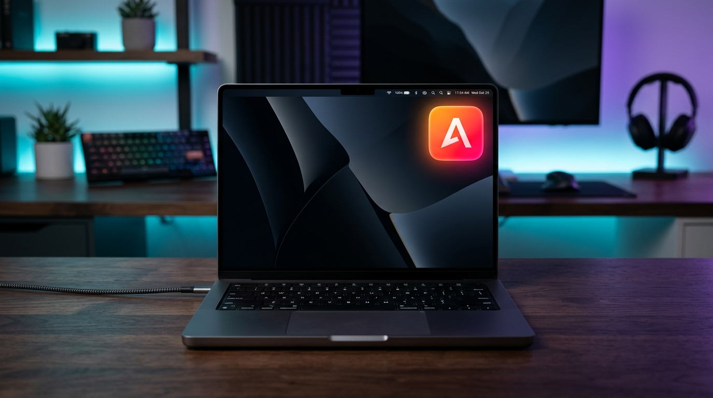
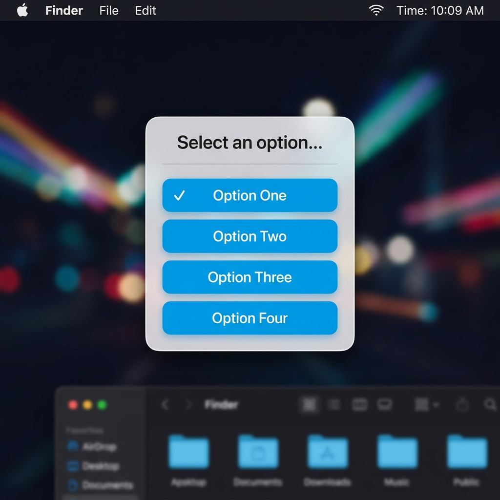

# IA Companion




A minimalist, premium macOS menu bar app that tracks your AI coding assistants (Claude, Antigravity, Codex). It features gorgeous native iOS-style icons, real-time status indicators (working/waiting), and lets you seamlessly answer interactive AI prompts directly from the menu bar without switching windows.

---

## 🌟 Features

- **Ultra-Premium Design**: Replaces ugly text indicators with stunning, high-contrast gradient "squircles" (rounded rectangles) that live in your menu bar.
- **Breathing Animations**: When an AI is thinking, its menu bar icon gently pulses, giving you immediate visual feedback.
- **Interactive Prompts**: Receive multiple-choice questions from your AI agents and answer them seamlessly via a beautiful SwiftUI dropdown directly from the menu bar.
- **Zero Config**: Completely un-intrusive. It runs 100% in the background.



## 🚀 Installation

Because we want to keep the repository clean of binaries, you'll need to compile the app yourself. Don't worry, it takes less than 10 seconds!

1. Clone the repository:
   ```bash
   git clone https://github.com/daniramosfer/IA-Companion.git
   cd IA-Companion
   ```
2. Run the build script:
   ```bash
   ./build_app.sh
   ```
3. Drag the newly generated `IACompanion.app` into your `/Applications` folder!

## 🔌 API Usage (For AI Developers)

IA Companion runs a lightweight local HTTP server on port `50152`. You can integrate any AI tool by sending simple `curl` requests!

### Update Status
Change the menu bar icon color for a specific AI.
- `idle` (Green)
- `working` (Orange, animated)
- `waiting` (Red)

```bash
curl -X POST http://localhost:50152/status \
  -H "Content-Type: application/json" \
  -d '{"id": "claude", "name": "Claude", "status": "working"}'
```

### Ask a Question
Trigger an interactive dropdown menu with options. The curl request will **block** until the user clicks an option in the menu bar.

```bash
curl -X POST http://localhost:50152/ask \
  -H "Content-Type: application/json" \
  -d '{
    "id": "antigravity",
    "question": "Should I push this to production?",
    "options": ["Yes, do it", "No, wait"]
  }'
```

## 🛠 Universal Automatic Watcher

To make IA Companion "just work" without having to manually start scripts or send `curl` commands, we've included a native macOS background daemon (`launchd`). 

It runs invisibly in the background on startup, constantly monitoring CPU usage and log files to detect when **Claude Desktop**, **Claude Code**, or **Antigravity** are thinking.

To install it so you never have to worry about it again, just run:
```bash
cd watcher
./install.sh
```

---
Built with ❤️ using Swift and SwiftUI.
